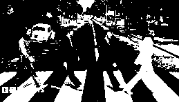

# 🎨 Projeto 02 — Conversão de Imagens para Tons de Cinza e Preto & Branco  

[](https://www.python.org/)  [](https://docs.python.org/3/library/tkinter.html)  [](https://pillow.readthedocs.io/en/stable/)  

> Segundo projeto do **Bootcamp Machine Learning** da [DIO](https://www.dio.me/) em parceria com a **BairesDev**.  
> Aplicação prática de **processamento digital de imagens** em Python, realizando conversão de imagens coloridas para **escala de cinza (0–255)** e **binarização (preto e branco, 0 ou 255)**.  

---

## **📌 Sobre o Projeto**  

Este projeto demonstra como manipular imagens em Python **sem depender de bibliotecas avançadas de visão computacional**.  
A leitura é feita com **Pillow (PIL)**, e todo o processamento é implementado em funções próprias, permitindo visualizar claramente como ocorre a transformação da imagem:  

1. **Imagem Colorida (RGB)** → **Escala de Cinza**  
2. **Escala de Cinza** → **Imagem Binarizada (PB)**  

**Objetivos do projeto**:  
- 🖼️ Permitir selecionar qualquer imagem local  
- ⚙️ Implementar conversão para cinza manualmente (média dos canais RGB)  
- 🌓 Gerar imagem binária a partir de um limiar (threshold = 127)  
- 💾 Exportar os resultados em formatos **PGM e PNG**  

---

## **🛠️ Tecnologias e Ferramentas**  

- **Python 3.10+** ([link](https://www.python.org/))  
- **Tkinter** → Seleção de arquivos via interface gráfica  
- **Pillow (PIL)** → Leitura básica da imagem em RGB  
- **Funções próprias** → para conversão e binarização  
- **PGM / PNG** → como formatos de saída  

---

## **📂 Estrutura do Projeto**  

```text
projeto-02-reducao-de-dimensionalidade/
├── LICENCE                     # Arquivo de licença MIT
├── README.md                   # Este arquivo
├── projeto_conversao_imagem.py # Script principal
├── conversor_saida.py          # Funções de conversão e salvamento
├── entrada.jpg                 # Imagem de entrada de exemplo
├── saida_cinza.pgm             # Saída em tons de cinza
├── saida_cinza.png             # Versão PNG da saída em cinza
├── saida_binaria.pgm           # Saída binarizada
└── saida_binaria.png           # Versão PNG da saída binária
```

---

## **📊 Resultados

A ferramenta **Tkinter** é utilizada para realizar o upload da imagem original em qualquer formato - no caso, utilizamos a imagem "entrada.jpeg"- para o programa gerar a conversão.
A conversão gera duas imagens a partir da original:

| Etapa              | Resultado                        |
| ------------------ | -------------------------------- |
| Escala de Cinza    | Valores entre 0–255              |
| Binarização (P\&B) | Valores 0 (preto) e 255 (branco) |

**Imagem em Tons de Cinza(pgm):** 


**Imagem Binarizada(pgm):** 


Como a saída em formato de extensão pgm é de difícil visualização gráfica, é possível converter as imagens para a extensão png através do programa **conversor_saida.py**.
É possível visualizar tanto a imagem original quantos as imagens convertidas:

### Imagem de Entrada Original


### Imagem em Tons de Cinza


### Imagem Binarizada


---

## 🚀 Como Executar

```bash
# Clone o repositório
git clone https://github.com/rodrigoulart/projeto-02-reducao-de-dimensionalidade.git

# Acesse a pasta do projeto
cd projeto-02-reducao-de-dimensionalidade

# Execute o programa principal
python projeto_conversao_imagem.py
```
Uma janela será aberta para selecionar a imagem.

O programa gera automaticamente os arquivos e salva na pasta do projeto:
- `saida_cinza.pgm`
- `saida_binaria.pgm`

```bash
# Para converter os arquivos para.png, é necessário executar o programa de conversão de saída
python conversor_saida.py
```

---

## 📚 Conceitos Aplicados

Escala de Cinza: transformação RGB → cinza usando média dos canais (R+G+B)/3

Binarização: aplicação de threshold (≥127 → 255, senão → 0)

Manipulação de Arquivos PGM e PNG: leitura e escrita em formatos simples de imagem

## 🏆 Créditos

Desenvolvido por Rodrigo Goulart de Moraes, como parte dos Desafios de Projetos do Bootcamp de Machine Learning da DIO em parceria com a BairesDev. 

📎 Repositório: github.com/rodrigoulart/projeto-02-conversao-imagens


